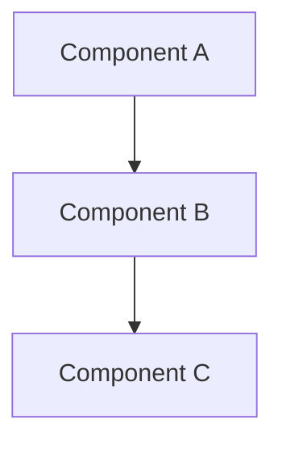

# Design Document

> ## ⛔ Forbidden sections (formal-doc 100% isolation principle)
>
> design.md **describes "the world after the decisions are made"** and carries no trace of the review process. The following sections / content **must absolutely NOT** appear in this document — violations will be rejected by `spec-verifier`:
>
> - Any form of Decision section — `## Architecture Decisions` / `## Decisions Record` / `## ADR` / `## Decision Log` — all Decision content belongs in `review-log.md §2`
> - Any **reviewer letter tag**: `(per Decision X)` / `(per Bug Y)` / `(per Smell Z)` / `Decision AL` / `Round 1 Bug C`
> - Any **review-process narration**: "raised in the Round N review" / "user resolved in Round 3" / "reviewer suggested" / "discovered during review"
> - Any **review-log reference**: the `review-log.md` string / `→ §W1` / `> ⓘ <one-liner> — see review-log`
> - Any **waiver / exception declaration**: `> **X exception (known and accepted)**:` / `<!-- WAIVED -->` / `<!-- REVIEWER NOTE -->`
>
> **If a Component's design needs to explain "why it was done this way"**: use **neutral design rationale** (technical constraints / codebase conventions / adverse consequences) integrated into the Component description. **Do not reveal** the reviewer source, Decision number, or review process. See `references/review-log-bad-examples.md` for examples.
>
> **Full rationale**: the review log is the single source of truth for "why this world"; design.md is the single source of truth for "what this world looks like". Physically isolating the two preserves the readability of each.

## Overview

[High-level description of the feature and its place in the overall system]

## Steering Document Alignment

### Technical Standards (tech.md)
[How the design follows documented technical patterns and standards]

### Project Structure (structure.md)
[How the implementation will follow project organization conventions]

## Code Reuse Analysis
[What existing code will be leveraged, extended, or integrated with this feature]

### Existing Components to Leverage
- **[Component/Utility Name]**: [How it will be used]
- **[Service/Helper Name]**: [How it will be extended]

### Integration Points
- **[Existing System/API]**: [How the new feature will integrate]
- **[Database/Storage]**: [How data will connect to existing schemas]

## Architecture

[Describe the overall architecture and design patterns used]

### Modular Design Principles
[Describe the modular design principles applicable to this feature]



## Components and Interfaces

### Component 1
- **Purpose:** [What this component does]
- **Interfaces:** [Public methods/APIs]
- **Dependencies:** [What it depends on]
- **Reuses:** [Existing components/utilities it builds upon]

### Component 2
- **Purpose:** [What this component does]
- **Interfaces:** [Public methods/APIs]
- **Dependencies:** [What it depends on]
- **Reuses:** [Existing components/utilities it builds upon]

## Data Models

### Model 1
```
[Define the structure of Model1 in your language]
- id: [unique identifier type]
- name: [string/text type]
- [Additional properties as needed]
```

### Model 2
```
[Define the structure of Model2 in your language]
- id: [unique identifier type]
- [Additional properties as needed]
```

## Error Handling

### Error Scenarios
1. **Scenario 1:** [Description]
   - **Handling:** [How to handle]
   - **User Impact:** [What user sees]

2. **Scenario 2:** [Description]
   - **Handling:** [How to handle]
   - **User Impact:** [What user sees]

## Testing Strategy

### Unit Testing
- [Unit testing approach]
- [Key components to test]

### Integration Testing
- [Integration testing approach]
- [Key flows to test]

### End-to-End Testing
- [E2E testing approach]
- [User scenarios to test]
