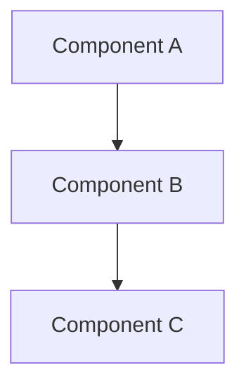

# Design Document

> ## ⛔ 禁止段落（formal doc 100% 隔離原則）
>
> design.md **描述「決定後的世界」**，不夾雜 review 過程的任何痕跡。以下段落 / 內容 **絕對不可** 出現於本文件 — 違反會被 `spec-verifier` 拒絕：
>
> - `## Architecture Decisions` / `## Decisions Record` / `## ADR` / `## Decision Log` 任何形式的 Decision 段落 — 所有 Decision content 屬 `review-log.md §2`
> - 任何 **reviewer letter tag**：`(per Decision X)` / `(per Bug Y)` / `(per Smell Z)` / `Decision AL` / `Round 1 Bug C`
> - 任何 **review 過程敘述**：「Round N review 提出」/ 「user 在 Round 3 拍板」/ 「reviewer 建議」/ 「review 期間發現」
> - 任何 **review-log 引用**：`review-log.md` 字串 / `→ §W1` / `> ⓘ <一句話> — 詳見 review-log`
> - 任何 **豁免 / 例外宣告**：`> **X 例外（已知並接受）**：` / `<!-- WAIVED -->` / `<!-- REVIEWER NOTE -->`
>
> **若某 Component 設計需要解釋「為什麼這樣做」**：用**中性 design rationale**（技術限制 / codebase 慣例 / 反面後果）整合進 Component 描述。**不揭露** reviewer 來源、Decision 編號、review 過程。範例見 `references/review-log-bad-examples.md`。
>
> **完整理由**：review log 是 single source of truth for 「為什麼是這個世界」；design.md 是 single source of truth for 「這個世界長什麼樣」。兩者物理隔離維持各自可讀性。

## Overview

[High-level description of the feature and its place in the overall system]

## Steering Document Alignment

### Technical Standards (tech.md)
[How the design follows documented technical patterns and standards]

### Project Structure (structure.md)
[How the implementation will follow project organization conventions]

## Code Reuse Analysis
[What existing code will be leveraged, extended, or integrated with this feature]

### Existing Components to Leverage
- **[Component/Utility Name]**: [How it will be used]
- **[Service/Helper Name]**: [How it will be extended]

### Integration Points
- **[Existing System/API]**: [How the new feature will integrate]
- **[Database/Storage]**: [How data will connect to existing schemas]

## Architecture

[Describe the overall architecture and design patterns used]

### Modular Design Principles
[Describe the modular design principles applicable to this feature]



## Components and Interfaces

### Component 1
- **Purpose:** [What this component does]
- **Interfaces:** [Public methods/APIs]
- **Dependencies:** [What it depends on]
- **Reuses:** [Existing components/utilities it builds upon]

### Component 2
- **Purpose:** [What this component does]
- **Interfaces:** [Public methods/APIs]
- **Dependencies:** [What it depends on]
- **Reuses:** [Existing components/utilities it builds upon]

## Data Models

### Model 1
```
[Define the structure of Model1 in your language]
- id: [unique identifier type]
- name: [string/text type]
- [Additional properties as needed]
```

### Model 2
```
[Define the structure of Model2 in your language]
- id: [unique identifier type]
- [Additional properties as needed]
```

## Error Handling

### Error Scenarios
1. **Scenario 1:** [Description]
   - **Handling:** [How to handle]
   - **User Impact:** [What user sees]

2. **Scenario 2:** [Description]
   - **Handling:** [How to handle]
   - **User Impact:** [What user sees]

## Testing Strategy

### Unit Testing
- [Unit testing approach]
- [Key components to test]

### Integration Testing
- [Integration testing approach]
- [Key flows to test]

### End-to-End Testing
- [E2E testing approach]
- [User scenarios to test]
