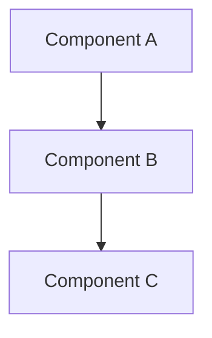

# Design Document

> ## ⛔ Forbidden sections (formal-doc 100% isolation principle)
>
> design.md **describes "the world after the decisions are made"** and carries no trace of the review process. The following sections / content **must absolutely NOT** appear in this document — violations will be rejected by `spec-verifier`:
>
> - Any form of Decision section — `## Architecture Decisions` / `## Decisions Record` / `## ADR` / `## Decision Log` — all Decision content belongs in `review-log.md §2`
> - Any **reviewer letter tag**: `(per Decision X)` / `(per Bug Y)` / `(per Smell Z)` / `Decision AL` / `Round 1 Bug C`
> - Any **review-process narration**: "raised in the Round N review" / "user resolved in Round 3" / "reviewer suggested" / "discovered during review"
> - Any **review-log reference**: the `review-log.md` string / `→ §W1` / `> ⓘ <one-liner> — see review-log`
> - Any **waiver / exception declaration**: `> **X exception (known and accepted)**:` / `<!-- WAIVED -->` / `<!-- REVIEWER NOTE -->`
>
> **If a Component's design needs to explain "why it was done this way"**: use **neutral design rationale** (technical constraints / codebase conventions / adverse consequences) integrated into the Component description. **Do not reveal** the reviewer source, Decision number, or review process. See `references/review-log-bad-examples.md` for examples.
>
> **Full rationale**: the review log is the single source of truth for "why this world"; design.md is the single source of truth for "what this world looks like". Physically isolating the two preserves the readability of each.

## Overview

[High-level description of the feature and its place in the overall system]

## Steering Document Alignment

### Technical Standards (tech.md)
[How the design follows documented technical patterns and standards]

### Project Structure (structure.md)
[How the implementation will follow project organization conventions]

## Code Reuse Analysis
[What existing code will be leveraged, extended, or integrated with this feature]

### Existing Components to Leverage
- **[Component/Utility Name]**: [How it will be used]
- **[Service/Helper Name]**: [How it will be extended]

### Integration Points
- **[Existing System/API]**: [How the new feature will integrate]
- **[Database/Storage]**: [How data will connect to existing schemas]

## Architecture

[Describe the overall architecture and design patterns used]

### Modular Design Principles
[Describe the modular design principles applicable to this feature]


```mermaid
graph TD
    A[Component A] --> B[Component B]
    B --> C[Component C]
```

## Components and Interfaces

### Component 1
- **Purpose:** [What this component does]
- **Interfaces:** [Public methods/APIs]
- **Dependencies:** [What it depends on]
- **Reuses:** [Existing components/utilities it builds upon]

### Component 2
- **Purpose:** [What this component does]
- **Interfaces:** [Public methods/APIs]
- **Dependencies:** [What it depends on]
- **Reuses:** [Existing components/utilities it builds upon]

## Data Models

### Model 1
```
[Define the structure of Model1 in your language]
- id: [unique identifier type]
- name: [string/text type]
- [Additional properties as needed]
```

### Model 2
```
[Define the structure of Model2 in your language]
- id: [unique identifier type]
- [Additional properties as needed]
```

## Error Handling

### Error Scenarios
1. **Scenario 1:** [Description]
   - **Handling:** [How to handle]
   - **User Impact:** [What user sees]

2. **Scenario 2:** [Description]
   - **Handling:** [How to handle]
   - **User Impact:** [What user sees]

## Testing Strategy

### Test Cases

Every case anchors to something that survives refactoring: a **requirement number** from requirements.md, or a **component's public interface** from this document. A case that can anchor to neither must not be written — an assertion about internal structure is a future time-sink, not coverage.

| ID | Anchor | Level | Behavior to verify |
|----|--------|-------|--------------------|
| T-1 | [R2.3] | behavior | [what an outside observer can check] |
| T-2 | [SyncQueue.push] | interface | [the contract a caller may rely on] |
| T-3 | [R4.1] | e2e | [the user-visible scenario, end to end] |

- **ID** — `T-{n}`, stable for the life of the spec. A removed case's number is never reused.
- **Anchor** — a requirement number (`R2.3`) or a public interface (`Component.method`). Never an internal function, private state, or a description of how the code works.
- **Level** — `behavior` (anchored to a requirement; a refactor must never break it), `interface` (anchored to a component contract; only an interface redesign may invalidate it), `e2e` (a user-visible scenario end to end).
- **Behavior to verify** — the observable outcome, not the mechanism. "concurrent push loses no items", never "push takes the lock before appending".

Coverage this table must satisfy: every requirement has at least one `behavior` case, every component's public interface has at least one `interface` case, and every scenario in Error Handling above has a case covering its failure path.

### Test Approach

- [Harness / framework and where test files live]
- [Fixture and test-data strategy]
- [What must NOT be mocked — the seams whose real behavior is the point of the test]
- [Anything that needs a design affordance to be testable at all: injection points, observable state, clock control]
